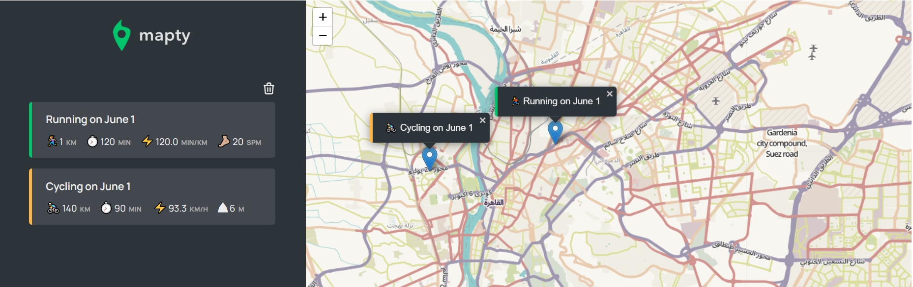

</img>

<h1 align="center">mapty|Map your workouts</h1>

  <h3>
    <a href="https://incandescent-pavlova-0b3236.netlify.app/" color="white" target="_blanck">
      Live
    </a>
   |  
     <a href="https://github.com/shawky55/Mapty-App">
      Solution
    </a> 
  </h3>

 
 
 

## About The Project

A small application to schedule your various activities, such as running or walking, and to clarify important information about each of them
  Your users should be able to:
 1. schedule your various activities
 2. reload page without lose their activities because using  local  storage

 

## Built with

- Semantic HTML5 markup
- CSS custom properties
- Flexbox
- JavaScript
- Leaflet
- local storage
- Desktop-first workflow
